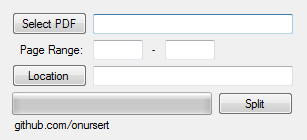

# PDF Split

PDF Split (with iTextSharp) - 2016 (C#)

PDF Split is a tool for Windows PCs allows you to split your PDFs.

The interface consists of a small screen. In program you choose PDF, select page range and new PDF location then you can split PDF easily. This app uses <a href="https://github.com/itext/itextsharp">iTextSharp</a> for split process.

PDF Split app doesn't require installation.

<a href="https://github.com/onursert/PDFSplit/raw/master/PDFSplit.zip">Download PDF Split</a>
